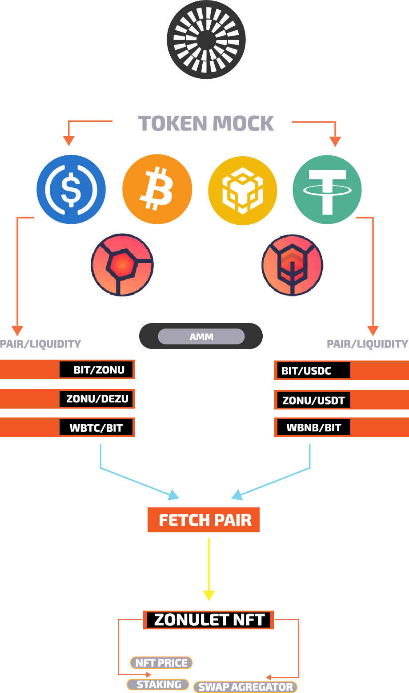

#### **Mantle Mash Gitcoin Hackathon Bounty - DeFi: https://gitcoin.co/issue/29735**

# DexSwap AMM ($DEZU)
DexSwap is Decentralized Protocol Optimizer for Multiple Exchanges
- [x] This AMM correlates with [Zonulet Marketplace](https://zonulet.io) to fetch pair data for each NFT Price, Swap and Staking
## **Demo Link: https://amm.zonulet.io**

## **Workflow**

## **How to swap and Create Pair/Add Liquidity: https://youtu.be/tE69YHtUVII**

