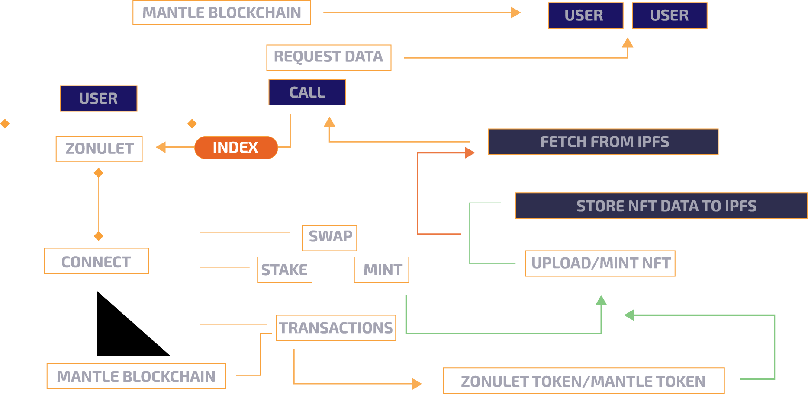

#### **Mantle Mash Gitcoin Hackathon Bounty - NFT & Gaming: https://gitcoin.co/issue/29736**
## Updated Wallet for Payout ETH ADDRESS
## 1. 0x3E301431458a4A5151241bBC09D8b80EfECcdcd2

# Zonulet Marketplace ($ZONU)
Zonulet is a decentralized marketplace that uses most of the Mantle Blockchain [ BIT ] and IPFS to store all nfts files from each user. Zonulet Marketplace does not store nft file data from each user using a backend or server side like other nft marketplaces do, all nfts data from each user can be fully accessed by anyone other than the user from Zonulet by pulling it from IPFS and we uses an end-to-end solution concept with DeFi and NFT elements that make it easier for every user to make transactions in just a few clicks.

## **Demo Link: https://zonulet.io**

## **Workflow**

## **Video**

#### **How to Mint NFT and Listed to the Public Sale:**
**https://youtu.be/XWaYOCaqkz4**

#### **How to Buy NFT and Give them to another Address:**
**https://youtu.be/f6ztefQwnLE**
